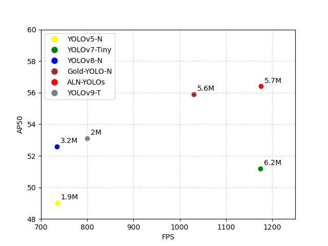

# Official ALN-YOLO

Shocking! This is an Image-Adaptive Lightweight Detector for Small Target Detection in Complex Environments.

Implementation of paper - [Run efficiently:An Image-Adaptive Lightweight Detector for Small Target Detection in Complex Environments]


<div align="center">
    <a href="./">
        
    </a>
</div>


## Performance 

MS COCO

| Model | Test Size | AP<sup>test</sup> | AP<sub>50</sub><sup>test</sup> | AP<sub>75</sub><sup>test</sup> | batch 1 fps | batch 32 average time |
| :-- | :-: | :-: | :-: | :-: | :-: | :-: |
| [**YOLOv5-N**] | 640 | **51.4%** | **69.7%** | **55.9%** | 161 *fps* | 2.8 *ms* |
| [**YOLOv7-Tiny**] | 640 | **53.1%** | **71.2%** | **57.8%** | 114 *fps* | 4.3 *ms* |
|  |  |  |  |  |  |  |
| [**YOLOv7-W6**]| 1280 | **54.9%** | **72.6%** | **60.1%** | 84 *fps* | 7.6 *ms* |
| [**YOLOv7-E6**] | 1280 | **56.0%** | **73.5%** | **61.2%** | 56 *fps* | 12.3 *ms* |
| [**YOLOv7-D6**] | 1280 | **56.6%** | **74.0%** | **61.8%** | 44 *fps* | 15.0 *ms* |
| [**YOLOv7-E6E**] | 1280 | **56.8%** | **74.4%** | **62.1%** | 36 *fps* | 18.7 *ms* |


## Installation

install requirements
<details><summary> <b>Expand</b> </summary>

``` shell

# pip install required packages
pip install -r requirements.txt

# go to code folder
cd /ALN-YOLO
```
</details>

## Eval
change the data/coco.yaml to your data path

eval ALN-YOLO

``` shell
python test.py --data data/coco.yaml --img 640 --batch 32 --conf 0.001 --iou 0.65 --device 0 --weights ALN-YOLOs.pt
```

You will get the results:

```
 Average Precision  (AP) @[ IoU=0.50:0.95 | area=   all | maxDets=100 ] = 0.51206
 Average Precision  (AP) @[ IoU=0.50      | area=   all | maxDets=100 ] = 0.69730
 Average Precision  (AP) @[ IoU=0.75      | area=   all | maxDets=100 ] = 0.55521
 Average Precision  (AP) @[ IoU=0.50:0.95 | area= small | maxDets=100 ] = 0.35247
 Average Precision  (AP) @[ IoU=0.50:0.95 | area=medium | maxDets=100 ] = 0.55937
 Average Precision  (AP) @[ IoU=0.50:0.95 | area= large | maxDets=100 ] = 0.66693
 Average Recall     (AR) @[ IoU=0.50:0.95 | area=   all | maxDets=  1 ] = 0.38453
 Average Recall     (AR) @[ IoU=0.50:0.95 | area=   all | maxDets= 10 ] = 0.63765
 Average Recall     (AR) @[ IoU=0.50:0.95 | area=   all | maxDets=100 ] = 0.68772
 Average Recall     (AR) @[ IoU=0.50:0.95 | area= small | maxDets=100 ] = 0.53766
 Average Recall     (AR) @[ IoU=0.50:0.95 | area=medium | maxDets=100 ] = 0.73549
 Average Recall     (AR) @[ IoU=0.50:0.95 | area= large | maxDets=100 ] = 0.83868
```
